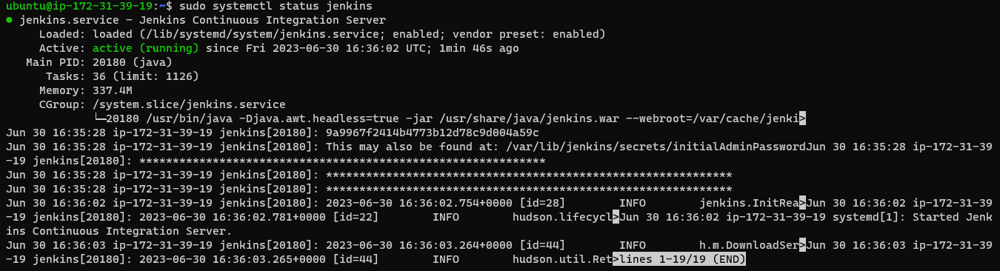
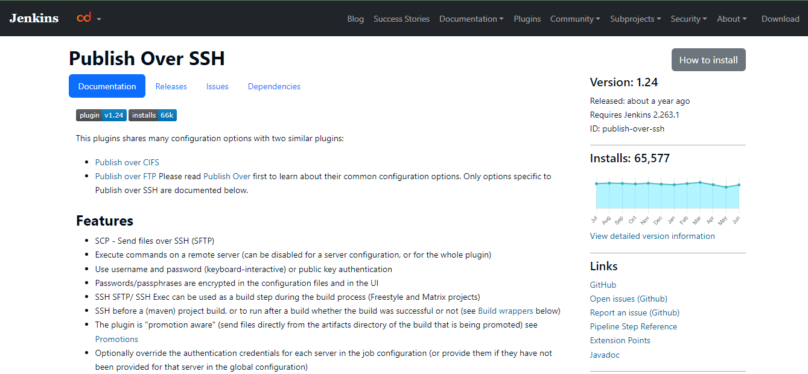
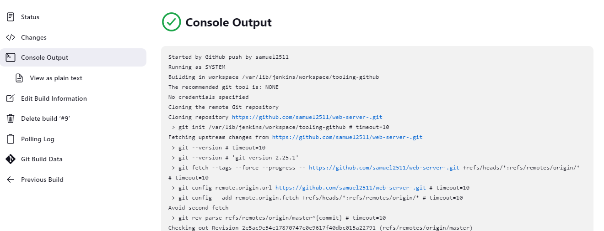
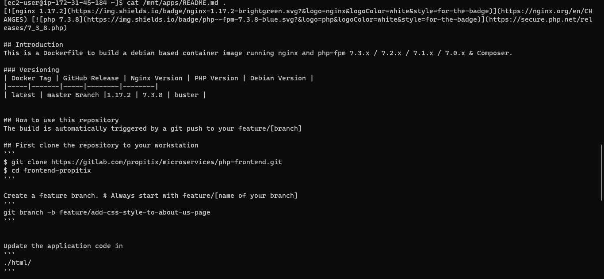

# TOOLING WEBSITE DEPLOYMENT AUTOMATION WITH CONTINUOUS INTEGRATION. INTRODUCTION TO JENKINS

in this project i install and configure jenkins server to transfer file when i commit to my respository

After launching an Ubuntu 20.04 LTS, I added the **port 8080** in the inbount rule, Then I connect to the server and update apt after that I installed JDK with `sudo apt install default-jdk-headless`

After that  I checked the status of jenkins to know if it's running

Then I opened jenkins UI on my browser with <public_ip_address>:8080, copied the default admin password from /var/lib/jenkins/secrets/initialAdminPassword 

i Installed Jenkins suggested plugins

Configure "Post-build Actions" to archive all the files

Then I save the file, move to my GitHub account edit and commit changes on the README.md file which the Jenkins automatically build the project and achive the files 

